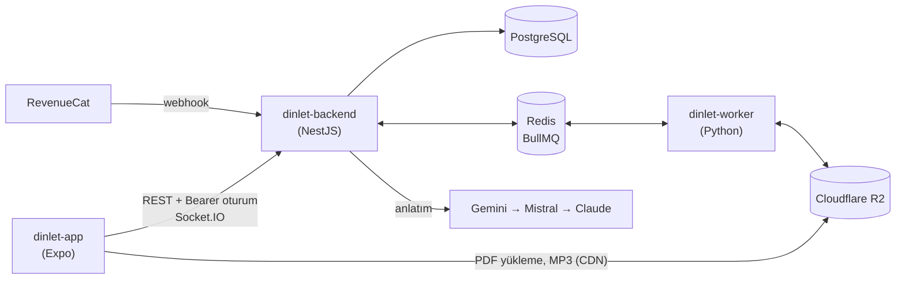

# Dinlet

**Dinlet**, sınava hazırlanan öğrencilerin (KPSS, YKS, ALES) ders notlarını
bölümlere ayrılmış, anlatılan seslere çeviren bir mobil uygulamadır. Öğrenci
PDF'ini yükler; Dinlet metni çıkarır, bölümlere ayırır, dinlemeye uygun hâle
getirir ve Türkçe seslendirir. Notlar otobüste ya da yürürken podcast gibi
dinlenir, aralıklı tekrar ve sesli sorularla pekiştirilir.

Bu depo uygulamanın tamamını içerir: mobil istemci, API ve ağır işleri yapan
Python worker.

## Bölümler

| Klasör                              | Ne                                                                             | Teknoloji                                   |
| ----------------------------------- | ------------------------------------------------------------------------------ | ------------------------------------------- |
| [`dinlet-app`](dinlet-app/)         | iOS ve Android istemci: yükleme, oynatıcı, tekrar, mağaza, kendi sesinle kayıt | Expo 57, React Native 0.86, TanStack Query  |
| [`dinlet-backend`](dinlet-backend/) | REST/WebSocket API: oturum, not işleme akışı, abonelik, mağaza, bildirim       | NestJS 12, Fastify, Prisma 8, BullMQ        |
| [`dinlet-worker`](dinlet-worker/)   | PDF → Markdown, Türkçe seslendirme, kendi sesinle kayıtları birleştirme        | Python 3.12, Docling, [ema-lightning](https://huggingface.co/canberkkkkkk/ema-lightning), ffmpeg |

Her klasörün kendi README'si ayrıntıları anlatır.

## Mimari



API ile worker birbirini çağırmaz; Redis'teki BullMQ kuyruklarıyla haberleşir.
Bir not şu yoldan geçer:

1. Uygulama PDF'i imzalı URL ile doğrudan R2'ye yükler, API notu açar ve
   sayfa kotasını düşer.
2. Worker PDF'i Docling ile Markdown'a çevirir (taranmış sayfada OCR).
3. API metni bölümlere ayırır. Pro'da LLM ile dinlemeye uygun anlatım ve bölüm
   sonu soruları üretilir, Free'de kural tabanlı temizlik yapılır.
4. Worker her bölümü Türkçe sayı ve kısaltma okunuşunu düzelterek seslendirir.
5. Uygulama ilerlemeyi Socket.IO ile izler; not hazır olunca push gelir.

## Öne çıkanlar

- Tekrar gelen veya kaçan kuyruk olaylarına dayanıklı, kendini onaran bir işleme akışı
- Sırayla denenen LLM sağlayıcıları; hepsi başarısız olsa da akış durmaz
- JWT'siz, cihaza bağlı mobil oturumlar; Google ve Apple ile giriş
- Aralıklı tekrar (1-3-7-21 gün) ve sesli soru oynatıcısı
- Not mağazası: katalog, paketler, tek seferlik satın alma, editör onaylı not paylaşımı
- Kendi sesinle kayıt: paragraf paragraf kayıt, worker'da ffmpeg ile birleştirme
- KVKK: ayrı rızalar, hesap silme ve 7 gün içinde kalıcı temizlik
- Backend'de gerçek Postgres, Redis ve LocalStack ile çalışan e2e testleri;
  API'nin OpenAPI şemasından üretilen tipli mobil istemci

## Hızlı başlangıç

Gerekenler: Docker, Node.js 24, pnpm 10; uygulama için Xcode veya Android Studio.

```bash
# API, worker ve servisler
cd dinlet-backend
cp config/.env.example config/.env
cp ../dinlet-worker/.env.example ../dinlet-worker/.env
docker compose up -d
docker exec dinlet-node pnpm db:update
docker exec dinlet-node pnpm db:seed

# Mobil uygulama
cd ../dinlet-app
pnpm install
cp .env.example .env
pnpm ios
```

API `http://localhost:3000/api/v1` adresinde, Swagger arayüzü `/api/v1/doc`'ta
çalışır. Ayrıntılar: [backend](dinlet-backend/README.md),
[worker](dinlet-worker/README.md), [uygulama](dinlet-app/README.md).

## Belgeler

- [Yol haritası](roadmap.md): fazlar, kararlar ve ilerleme
- [Geliştirici notları](dinlet-backend/docs/development.md): oturum modeli, altyapı, Prisma 8
- [Production kurulumu](dinlet-backend/DEPLOY.md): Dokploy, Cloudflare, R2, RevenueCat

## Teşekkürler

Türkçe seslendirme altyapısında kullandığımız hızlı ve kaliteli [ema-lightning](https://huggingface.co/canberkkkkkk/ema-lightning) modelini açık kaynak olarak toplulukla paylaştığı için [@canberkkkkkk](https://huggingface.co/canberkkkkkk)'e çok teşekkürler! 🎧

## Lisans

[MIT](LICENSE)
