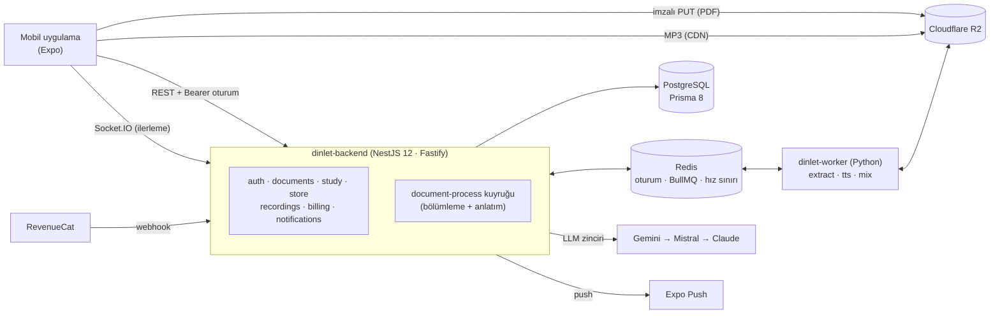
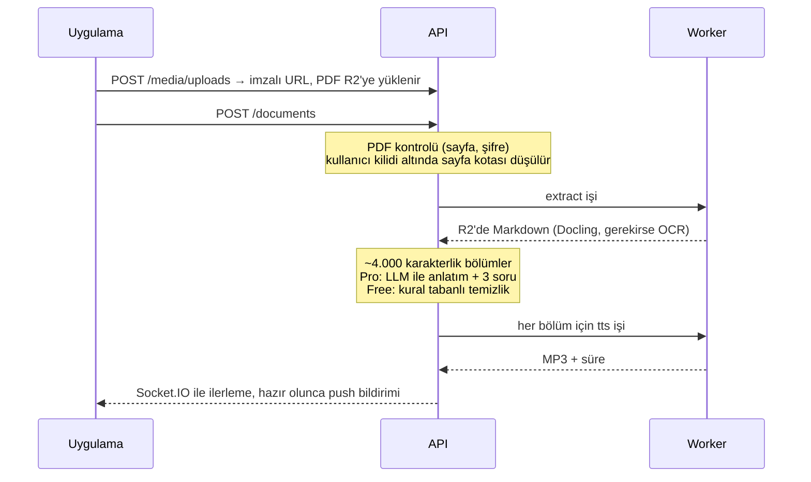

# Dinlet API

**Dinlet**, sınava hazırlanan öğrencilerin (KPSS, YKS, ALES) ders notlarını
bölümlere ayrılmış, anlatılan seslere çeviren bir mobil uygulamadır. Bu klasör
uygulamanın backend'idir. Öğrenci bir PDF yükler; Dinlet metni çıkarır,
bölümlere ayırır, dinlemeye uygun hâle getirir, Türkçe seslendirir ve
dinleme ilerlemesi, aralıklı tekrar ve sesli sorularla birlikte oynatıcıya
sunar.

Dinlet üç parçadan oluşur (genel bakış: [ana README](../README.md)):

| Depo               | Ne                                                                           |
| ------------------ | ---------------------------------------------------------------------------- |
| **dinlet-backend** | Bu klasör. NestJS 12 + Fastify REST/WebSocket API, iş kuyrukları             |
| **dinlet-worker**  | Python worker: PDF → Markdown (Docling), Türkçe seslendirme, ses birleştirme |
| **dinlet-app**     | Expo / React Native istemci (iOS, Android)                                   |

## Mimari



API ile worker birbirini hiç çağırmaz; Redis'teki BullMQ kuyruklarını
paylaşırlar. API işi tekrar eklenemeyen (idempotent) kimlikle kuyruğa koyar,
worker çıktısını R2'ye yazıp küçük bir sonuç döner, API de kuyruk
olaylarından durumu günceller.

### Not işleme akışı



## Öne çıkanlar

- **Hataya dayanıklı iş akışı.** Durum geçişleri koşullu güncellemedir
  (`QUEUED → EXTRACTING → … → READY | PARTIAL | FAILED`); tekrar gelen veya
  geciken kuyruk olayları zarar vermez. Her 5 dakikada bir çalışan uzlaştırıcı,
  API kapalıyken kaçan olayları onarır. Başarısız notun sayfa kotası iade edilir.
- **Kademeli LLM kullanımı.** Anlatım sırayla Gemini, Mistral ve Anthropic'i
  dener. Kotası dolan model dinlendirilir, güvenlik reddinde sıradaki
  sağlayıcıya geçilir; hepsi başarısız olursa bölüm kural tabanlı metinle
  seslendirilir, akış durmaz. Her çağrının token kullanımı ve maliyeti
  kaydedilir. LLM özellikleri yurt dışı aktarım için açık rıza ister (KVKK).
- **JWT'siz mobil kimlik doğrulama.** Oturumlar sunucu tarafında, Redis'te
  tutulur. Mobil istemci oturumu cihaz kimliğine bağlı bir `Bearer` değeri
  olarak taşır; çalınan token başka cihazda çalışmaz. Google ve Apple girişi
  ID token doğrulamasıyla yapılır, hesap eşleştirme yalnızca doğrulanmış
  e-postada çalışır; hesap kilitleme, yeni cihaz uyarısı ve açık oturum listesi
  vardır.
- **Abonelik ve kota.** RevenueCat webhook'ları tekrar ve sıra karışıklığına
  dayanıklıdır; API anahtarı tanımlıysa abone durumu olaydan değil RevenueCat
  REST API'sinden okunur. Aylık sayfa kotası, İstanbul saatine göre dönemlere
  ayrılmış bir defterdir.
- **Not mağazası.** Sınav ve ders kataloğu, ücretsiz ve ücretli içerikler,
  paketler, tek seferlik satın alma, iade ve "satın almaları geri yükle".
  Eklenen içerik kotadan düşmeden kullanıcının kütüphanesine kopyalanır, ses
  dosyalarını kaynakla paylaşır. Her kullanıcı kendi notunu ücretsiz
  paylaşabilir; editör inceler, onayda not ve sesleri ayrıca kopyalanır.
  Böylece yazar kendi notunu değiştirse veya silse de mağazadaki sürüm bozulmaz.
- **Kendi sesinle kayıt.** Kullanıcı bir bölümü uygulamadan paragraf paragraf
  kaydeder. Worker klipleri ffmpeg ile (aralar, ses seviyesi eşitleme) tek
  MP3'e birleştirir, oynatıcı bu sese geçer.
- **Çalışma araçları.** Klasör, etiket ve sınav geri sayımı; sesli sorularla
  aralıklı tekrar (1, 3, 7 ve 21 gün); nottaki tarih, sayı ve isimlerin
  anlatımda geçtiğini doğrulayan kapsam kontrolü; hafıza kancaları; her bölüm
  için "hızlı tekrar" sürümü.
- **Gizlilik.** Sürümlü rıza kayıtları, kullanıcıyı hemen anonimleştirip
  dosyaları 7 gün içinde silen hesap silme, tahmin edilemez ses anahtarları ve
  her isteğin hassas alanları maskelenmiş denetim kaydı.
- **Operasyon.** Kuyrukla toplu yazılan denetim kaydı, yöneticiler için Bull
  Board, e-postayla kuyruk sağlığı uyarısı, veritabanından yönetilen
  zamanlanmış işler ve CASL ile rol tabanlı yetki.

## Teknolojiler

| Alan             | Seçim                                                                |
| ---------------- | -------------------------------------------------------------------- |
| Çalışma ortamı   | Node.js 24, TypeScript 6, Fastify 5 üzerinde NestJS 12               |
| Veritabanı       | PostgreSQL, Prisma 8 (contract-first modeller, planlı migration'lar) |
| Kuyruk, önbellek | Redis, BullMQ, Redis'te `@fastify/session`, Redis tabanlı hız sınırı |
| Depolama         | Cloudflare R2 (S3 API), imzalı yükleme, CDN'den ses                  |
| Gerçek zamanlı   | Redis adapter'lı Socket.IO, Expo Push                                |
| Yapay zekâ       | Gemini, Mistral ve Anthropic API'leri; ses için Python worker        |
| Ödeme            | RevenueCat (App Store ve Google Play)                                |
| Kalite           | Vitest (birim + e2e), oxlint, Husky + commitlint, GitHub Actions     |
| Yayın            | GHCR'de Docker imajları, tek VPS'te Dokploy, Cloudflare              |

## Klasör yapısı

```
src/
  core/        guard, interceptor, decorator, HTTP yanıt zarfı, ortak yardımcılar
  infra/       veritabanı (Prisma 8 contract + migration), redis, kuyruk, s3,
               llm, zamanlanmış işler, denetim kaydı, oturum, bildirim, gözlem
  modules/
    auth/          oturum, Google/Apple girişi, rızalar, hesap silme
    document/      notlar, bölümler, işleme akışı, dinleme, kapsam, hızlı tekrar
    study/         klasör, etiket, sınav hedefi, aralıklı tekrar
    store/         katalog, paketler, satın alma, not paylaşımı, yönetim
    recording/     kendi sesinle kayıt, ses tercihi
    billing/       plan, kota, RevenueCat
    notification/  uygulama içi bildirim, Socket.IO, Expo push
    media/         imzalı PDF yükleme
test/              birim testleri ve e2e (test/e2e)
```

## Yerelde çalıştırma

Gerekenler: Docker; testleri Docker dışında çalıştırmak için Node.js 24 ve
pnpm 10. Compose, worker'ı yandaki `../dinlet-worker` klasöründen derler.

```bash
cp config/.env.example config/.env                  # gerekli sırları doldur
cp ../dinlet-worker/.env.example ../dinlet-worker/.env
docker compose up -d                                # Postgres, Redis, LocalStack, API, worker

docker exec dinlet-node pnpm db:update              # şemayı uygula
docker exec dinlet-node pnpm db:seed                # roller, izinler, örnek kullanıcılar, mağaza kategorileri
```

API, kod değişince kendini yenileyerek `http://localhost:3000/api/v1`
adresinde çalışır; Swagger arayüzü `/api/v1/doc`'tadır. Worker ilk açılışta
ses ve belge modellerini indirir. LLM anahtarları isteğe bağlıdır; yoksa
notlar kural tabanlı yoldan seslendirilir. Worker kodu değişince
`docker restart dinlet-tts` ile yeniden başlatılmalıdır.

## Testler

```bash
pnpm install
pnpm test        # birim testleri

# e2e: localhost'ta Postgres, Redis ve LocalStack gerekir
docker exec dinlet-postgres createdb -U dinlet-user dinlet-test   # bir kez
pnpm test:e2e
```

E2E testleri uygulamanın tamamını ayağa kaldırır ve Python worker yerine aynı
kuyruk sözleşmesine uyan sahte worker'lar kullanır. Not işleme akışını, giriş
ve giriş güvenliğini, aboneliği, mağaza ve not paylaşımını, ses kayıtlarını ve
çalışma araçlarını kapsar. CI; typecheck, lint, birim ve e2e testlerini
çalıştırır, ardından Docker imajını derleyip yayınlar.

## Belgeler

- [Geliştirici notları](docs/development.md): oturum modeli, altyapı, Prisma 8 iş akışı
- [Production kurulumu](DEPLOY.md): Dokploy, Cloudflare, R2, RevenueCat, yedekler

## Lisans

[MIT](LICENSE)
